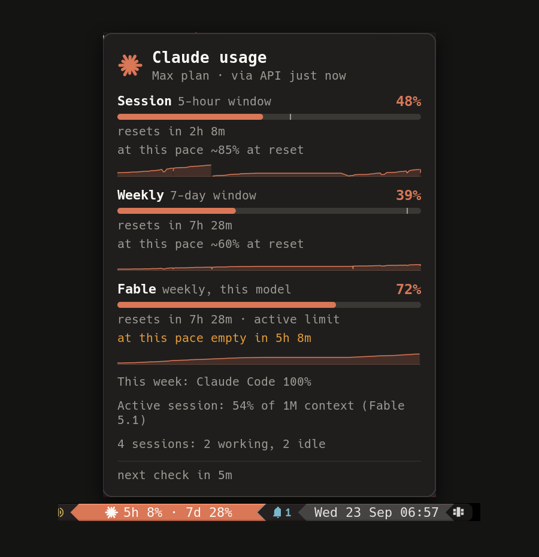
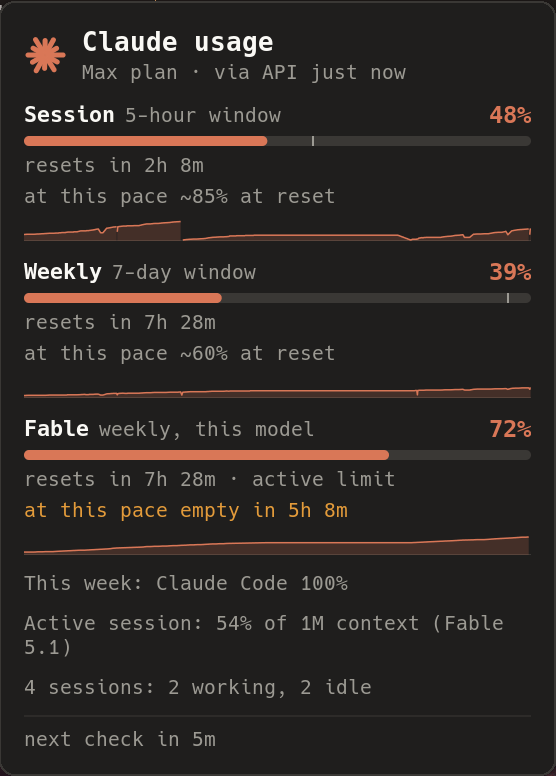

<h1 align="center">awesome-claude-usage</h1>

<p align="center">
  Your Claude Code limits, right in the AwesomeWM bar.
</p>

<p align="center">
  <a href="https://github.com/derblub/awesome-claude-usage/actions/workflows/ci.yml"></a>
  <a href="https://github.com/derblub/awesome-claude-usage/releases"></a>
  <a href="LICENSE"></a>
  
  <a href="https://www.reddit.com/r/awesomewm/comments/1wnzmmk/awesomeclaudeusage_claude_code_rate_limits_5h_7d/"></a>
</p>

<p align="center">
  
</p>

An [AwesomeWM](https://awesomewm.org/) wibar widget that shows how much of your
[Claude Code](https://code.claude.com/) subscription limits you have used: the
5-hour session window and the 7-day weekly window, exactly what `/usage` prints
inside Claude Code, without leaving your editor.

It looks the part: a terracotta chip with the starburst icon in the bar, and a
warm dark popup with one progress bar per window, reset times, per-model weekly
limits, extra usage and data age. The chip turns amber and red as you approach
your limits, a desktop notification fires once per threshold crossing, and a
click opens Claude Code.

**Contents:**
[Features](#features) ·
[Requirements](#requirements) ·
[Installation](#installation) ·
[Configuration](#configuration) ·
[statusLine helper](#the-statusline-helper-fresh-data-without-network-calls) ·
[CLI](#cli-waybar-polybar-tmux) ·
[Forecast](#forecast-and-pacing) ·
[Sessions](#sessions) ·
[How it works](#how-polling-and-rate-limiting-work) ·
[Security](#security) ·
[Troubleshooting](#troubleshooting) ·
[Development](#development)

## Features

- Claude-styled chip: cairo-drawn starburst icon, terracotta background, cream text;
  amber at 75 %, red at 90 % (configurable), grey when nothing works
- `style = "bare"` for themes that colour their own segments (icon + text only)
- Hover popup in the same palette: logo header, plan and data source, a progress bar
  per window with `resets in 2h 14m`, model-scoped weekly limits (e.g. `Fable 51%`),
  weekly usage by surface, extra-usage spend, next check
- Forecast from your own usage history: "at this pace ~38% at reset" or "empty in 1h 20m",
  a pacing marker on the weekly bar and a 24-hour sparkline per window
- Running Claude Code sessions: how many work, idle or wait for you; a flag in the bar and a
  notification when one needs your attention
- Adaptive polling: every 5 minutes while a session works, every 15 minutes otherwise, and a
  fresh statusLine cache skips the network call entirely
- Desktop notification once per threshold crossing, re-armed after the window resets
- The active session's context window ("41% of 1M") and instant updates through a
  Claude Code hook and an inotify watch on the statusLine cache
- Compact mode (icon only, the chip fills up like a bar), a `$` marker for paid extra
  usage, and a choice of which windows appear in the bar and colour the chip
- Pinned popups close with Escape or a click anywhere; a key binding can open the popup
- `cli.lua` prints the same data for waybar, polybar, tmux or your prompt
- Left click opens a terminal with `claude` (configurable), right click refreshes, middle click pins the popup
- Three data sources with automatic fallback:
  1. Claude Code's OAuth usage endpoint (`api.anthropic.com/api/oauth/usage`)
  2. a cache file written by the Claude Code **statusLine** (see below), no network needed
  3. `~/.claude.json`, Claude Code's own cached copy of the last `/usage` result
- Exponential backoff on HTTP 429 and network errors; the bar never hammers the endpoint
- Reads the OAuth token only. It never refreshes or writes it, so it cannot log you out.
- Pure Lua, no LuaRocks dependencies; `curl` is the only external tool (`jq` for the optional
  statusLine helper, a standalone `lua` for the CLI)

| Bar | Popup |
|---|---|
|  |  |

## Requirements

- AwesomeWM git (4.3-git, API level 4) is what it is developed and tested on. Stable 4.3 is
  untested; notifications fall back to `naughty.notify` there, but other API differences may bite
- `curl`
- Claude Code, logged in with a claude.ai Pro or Max subscription (API-key users have no rate-limit windows)
- Any font; the icon is drawn with cairo. A Nerd Font is only needed for `icon = "glyph"`

## Installation

```sh
git clone https://github.com/derblub/awesome-claude-usage.git ~/.config/awesome/claude_usage
```

Then in `rc.lua`:

```lua
local claude_usage = require("claude_usage")

-- ... inside your wibar setup:
s.mywibox:setup({
    layout = wibox.layout.align.horizontal,
    { layout = wibox.layout.fixed.horizontal, s.mytaglist },
    s.mytasklist,
    {
        layout = wibox.layout.fixed.horizontal,
        claude_usage.new({ on_click = terminal .. " -e claude" }),
        mytextclock,
    },
})
```

The directory name does not matter: clone it as `claude_usage`, `awesome-claude-usage`
or anything else and `require` that name. A complete minimal configuration is in
[`example/rc.lua`](example/rc.lua).

## Configuration

Every option is optional. Defaults shown.

```lua
claude_usage.new({
    -- Polling
    interval      = 300,      -- seconds between fetches (minimum 120; lower values only earn 429s)
    initial_delay = 5,        -- seconds after startup before the first fetch
    jitter        = 30,       -- random +/- seconds on every interval
    timeout       = 15,       -- curl --max-time
    backoff       = { 300, 600, 1200, 1800 }, -- delays after consecutive 429/5xx/network errors
    sources       = { "api", "statusline", "claude_json" }, -- priority; remove entries to disable
    credentials_path = os.getenv("HOME") .. "/.claude/.credentials.json",
    claude_json_path = os.getenv("HOME") .. "/.claude.json",
    cache_path    = (os.getenv("XDG_CACHE_HOME") or os.getenv("HOME") .. "/.cache") .. "/claude-usage/rate_limits.json",
    stale_after   = 3600,     -- cached data older than this is marked "(stale)"
    fresh_cache_max_age = 120, -- a statusLine cache younger than this replaces the API call
                              -- (the API is still asked at least every interval_idle)

    -- Sessions (~/.claude/sessions) and adaptive polling
    sessions      = true,     -- watch running Claude Code sessions
    sessions_dir  = os.getenv("HOME") .. "/.claude/sessions",
    sessions_interval = 10,   -- seconds between directory scans (local files only)
    interval_idle = 900,      -- fetch interval while no session is working
    sessions_in_bar = true,   -- append a flag to the bar text when a session waits for you
    attention_flag = " \u{2691}",
    spend_in_bar  = true,     -- append the extra usage spent (" +3.53€") while it is being consumed
    spend_flag    = nil,      -- a fixed marker instead of the amount, e.g. " $"
    watch_cache   = true,     -- read the statusLine cache the moment it changes (needs inotifywait)
    context_max_age = 900,    -- show the active session's context window while the cache is this fresh
    notify_attention = true,  -- a session waits for a permission or an answer
    notify_finished = false,  -- a session went from working to idle

    -- History and forecast
    history       = true,     -- record samples, show burn rate / forecast / pacing
    history_path  = (os.getenv("XDG_CACHE_HOME") or os.getenv("HOME") .. "/.cache") .. "/claude-usage/history.csv",
    sparkline_hours = 24,     -- popup sparkline range

    -- Appearance
    font          = nil,      -- nil = beautiful.font; popup fonts are derived from it
    style         = "chip",   -- "chip": rounded terracotta pill; "bare": icon + text only
    icon          = "starburst", -- "starburst" (drawn), "glyph" (text, needs a Nerd Font), "none"
    icon_size     = nil,      -- px, nil = 1.35 × font size
    glyph         = "\u{f0e7}", -- for icon = "glyph"
    separator     = " · ",
    forced_width  = nil,      -- e.g. dpi(140) for a fixed width
    thresholds    = { warn = 75, crit = 90 },
    chip          = { normal = "#D97757", warn = "#E39B3A", crit = "#C8442E", error = "#4A4744",
                      fg = "#FAF9F5", radius = 6, padding_x = 8, padding_y = 1 },
    colors        = { normal = nil, warn = "#E39B3A", crit = "#C8442E", error = "#9C9A93",
                      stale = nil, icon = "#D97757" },  -- text/icon colours for style = "bare"
    color_target  = "text",   -- "none": never colour the text (style = "bare" only)
    format        = nil,      -- custom bar text, see below
    compact       = false,    -- icon only; the chip fills up like a bar
    bar_windows   = { "five_hour", "seven_day", "scoped" }, -- windows in the bar text; "scoped" = every
                              -- per-model limit as its first letter ("F 100%"), or name one with "scoped:Fable"
    color_window  = "max",    -- window that colours the chip/text: "max", "five_hour", "seven_day", "scoped:<Model>"

    -- Popup
    popup         = true,     -- built-in hover popup; false to build your own
    popup_width   = 340,      -- dpi
    popup_colors  = { bg = "#1F1E1D", fg = "#FAF9F5", muted = "#9C9A93", border = "#3A3835",
                      track = "#3A3835", accent = "#D97757", warn = "#E39B3A", crit = "#C8442E" },
    popup_border_width = 1, popup_radius = 10,
    popup_show_scoped = true, popup_show_spend = true, popup_show_breakdown = true,
    popup_escape = true,      -- Escape closes a pinned popup
    popup_click_away = true,  -- a click anywhere closes a pinned popup

    -- Notifications (naughty)
    notify_threshold = true,  -- when a window crosses warn/crit
    notify_reset     = false, -- when a window resets after it was above warn
    notify_error     = false, -- after three consecutive failed checks without any data
    notify_timeout   = 8,

    -- Mouse
    on_click        = "xterm -e claude", -- string: run with a shell; function(state, widget)
    on_right_click  = nil,    -- default: refresh now
    on_middle_click = nil,    -- default: pin/unpin the popup
})
```

### Custom bar text

```lua
format = function(state, fmt)
    if not fmt.has_data(state) then return "claude ?" end
    return string.format("W %d%%", fmt.round(state.seven_day.percent))
end
```

`state` is described below; `fmt` is the `claude_usage.format` helper table
(`round`, `relative`, `age`, `has_data`, `level_for`, `chip_color`, `popup_lines`,
`popup_rows`, ...).
Return plain text; the widget escapes it for Pango.

### Fitting into a themed bar

With `style = "bare"` the widget draws only the icon and the text and inherits
the foreground colour of whatever you put it in. Combine it with
`format.chip_color(state, opts)` to paint your own segment:

```lua
local w = claude_usage.new({ style = "bare", color_target = "none", colors = { icon = "#FAF9F5" } })
local segment = wibox.container.background(w, "#D97757")
segment.fg = "#FAF9F5"
claude_usage.subscribe(function(state)
    segment.bg = claude_usage.format.chip_color(state, claude_usage.opts)
end)
```

### Using the model without the built-in widget or popup

```lua
local claude_usage = require("claude_usage")
claude_usage.setup({ popup = false })

claude_usage.subscribe(function(state)
    -- called immediately if data exists, then on every update (about once a minute)
    my_textbox.text = claude_usage.format.bar_text(state, claude_usage.opts)
    my_tooltip.text = table.concat(claude_usage.format.popup_lines(state, os.time(), claude_usage.opts), "\n")
end)
```

Besides `state` and `subscribe`, the module exposes `claude_usage.refresh({ force = true })`,
`claude_usage.stop()`, `claude_usage.debug()` (a text dump for bug reports),
`claude_usage.toggle_popup()` / `hide_popup()`, `claude_usage.refresh_sessions()`,
`claude_usage.model.samples()` (the history samples) and `claude_usage.model.sessions()`.

### Key binding

```lua
awful.key({ modkey, "Shift" }, "u", function()
    require("claude_usage").toggle_popup()
end, { description = "Claude usage", group = "launcher" })
```

The popup opens pinned next to the widget (preferring the one on the focused screen);
Escape or any click closes it.

The state table:

```lua
{
    five_hour  = { percent = 3,  resets_at = 1790023800, is_active = false },  -- or nil
    seven_day  = { percent = 67, resets_at = 1790175600, is_active = true },   -- or nil
    scoped     = { { name = "Fable", percent = 51, resets_at = 1790175600 } }, -- per-model weekly limits
    spend      = { enabled = false, percent = 0, used = 0, currency = "USD", limit = nil }, -- extra usage
    breakdown  = { { name = "Claude Code", percent = 89 }, { name = "Chats", percent = 11 } },
    forecast   = { five_hour = { rate = 0.0012, at_reset = 38, exhaust_at = nil }, seven_day = { ... }, scoped = {} },
    pace       = { five_hour = 20, seven_day = 55 },   -- percent an even spread would be at now
    sessions   = { total = 2, working = 1, idle = 1, attention = 0, list = { ... } },
    fetched_at = 1758560000,  -- epoch seconds when the data was produced
    source     = "api",       -- "api" | "statusline" | "claude_json"
    stale      = false,
    error      = nil,         -- or { code = "rate_limited", message = "...", retry_at = ... }
    next_fetch_at = 1758560300,
    subscription  = "max",
}
```

`error.code` is one of `unauthorized`, `no_credentials`, `rate_limited`,
`network`, `parse`, `no_source`. When a fetch fails but cached data exists,
both the data and the error are present.

## The statusLine helper (fresh data without network calls)

Claude Code passes a JSON document with a `rate_limits` object to your
[statusLine](https://code.claude.com/docs/en/statusline) command on every turn.
`contrib/statusline-cache.sh` stores that object in
`~/.cache/claude-usage/rate_limits.json` (mode 600, written atomically) and then
hands the unchanged JSON to your existing statusline command, if any.

`~/.claude/settings.json`:

```json
{
  "statusLine": {
    "type": "command",
    "command": "~/.config/awesome/claude_usage/contrib/statusline-cache.sh"
  }
}
```

With an existing statusline script, append it as an argument:

```json
"command": "~/.config/awesome/claude_usage/contrib/statusline-cache.sh ~/.claude/my-statusline.sh"
```

Requires `jq`. The cache only updates while a Claude Code session is running;
the widget marks it stale after an hour and prefers the API when that works.
To rely on the cache alone (no network at all): `sources = { "statusline" }`.

The helper also stores the active session's context window (`used_percentage`, size,
input tokens), the model name and the session id. The popup shows them as
"Active session: 41% of 1M context (Fable)" while the cache is younger than
`context_max_age`. With `inotify-tools` installed the widget picks up every rewrite
of the cache instantly (`watch_cache`); otherwise it reads it on the next fetch.

## The hook (instant "needs your attention")

`contrib/claude-usage-hook.sh` is a [Claude Code hook](https://code.claude.com/docs/en/hooks)
for the `Notification` and `Stop` events. It calls `awesome-client` with the event name,
the notification type and the session id (nothing else), so the widget rescans
`~/.claude/sessions` right away and raises the "needs your attention" notification for
permission prompts, questions and idle prompts without waiting for the next scan.

```json
"hooks": {
  "Notification": [{ "hooks": [{ "type": "command", "async": true, "timeout": 5,
                     "command": "~/.config/awesome/claude_usage/contrib/claude-usage-hook.sh" }] }],
  "Stop":         [{ "hooks": [{ "type": "command", "async": true, "timeout": 5,
                     "command": "~/.config/awesome/claude_usage/contrib/claude-usage-hook.sh" }] }]
}
```

`async` keeps Claude Code from waiting; without AwesomeWM (or `awesome-client`) the hook
exits silently. Repeated attention notifications for the same session are dropped for a minute.

## CLI (waybar, polybar, tmux)

`cli.lua` runs the same code without AwesomeWM:

```sh
lua5.4 ~/.config/awesome/claude_usage/cli.lua            # 5h 16% · 7d 4%
lua5.4 ~/.config/awesome/claude_usage/cli.lua --lines    # the popup text
lua5.4 ~/.config/awesome/claude_usage/cli.lua --json     # the state table
lua5.4 ~/.config/awesome/claude_usage/cli.lua --waybar   # {"text","tooltip","class","percentage"}
```

It caches its result in `~/.cache/claude-usage/last.json` and reuses it for
`--max-age` seconds (default 300), keeps the same backoff on 429, and records the
history file, so a bar may call it every few seconds. `--no-network` uses the cache
files only. Waybar example:

```json
"custom/claude": {
  "exec": "lua5.4 ~/.config/awesome/claude_usage/cli.lua --waybar",
  "return-type": "json",
  "interval": 60
}
```

The `class` is `normal`, `warn`, `crit`, `stale` or `error` for styling.

## Forecast and pacing

Every fresh result is appended to `~/.cache/claude-usage/history.csv`
(`epoch,window,percent,resets_at`, pruned to the last eight days). From the samples
of the current reset cycle the widget derives a burn rate per window and shows:

- **at this pace ~38% at reset** when the window will survive until its reset,
- **at this pace empty in 1h 20m** (amber, red under an hour) when it will not,
- **no usage lately** when the percentage has not moved,
- **limit reached** (red) once the window is used up.

A forecast needs at least 15 minutes of samples for the 5-hour window and 3 hours
for the weekly windows; before that the line is simply absent. The thin marker on a
bar is the pacing point, the percentage an even spread over the window would be at
right now. The sparkline under each bar shows the last `sparkline_hours` (at least one
hour) of that window; a drop of more than 20 points is drawn as a reset.

## Sessions

Claude Code writes one small JSON file per running process to `~/.claude/sessions/`.
The widget scans that directory every `sessions_interval` seconds (local files only)
and skips files whose process is gone. States are mapped to *working* (`busy`),
*idle* and *attention* (`waiting`, `needs_input`). The popup lists the counts, the bar
text gets `attention_flag` appended while any session waits for you, and
`notify_attention` / `notify_finished` control the desktop notifications. The scan
also drives the polling interval: `interval` while something is working,
`interval_idle` otherwise, plus one early fetch when work starts or stops.
Set `sessions = false` to turn all of this off.

## How polling and rate limiting work

The usage endpoint is the one Claude Code itself calls for `/usage`. It is not
documented and it rate-limits aggressively: too many calls and it answers
`429` for a while. The widget therefore

- polls every 5 minutes with a little jitter while a Claude Code session is working and every
  15 minutes otherwise (`interval` cannot go below 120 s), with one early check when work starts or stops,
- skips the call when the statusLine cache is younger than two minutes, but still asks the API at
  least every `interval_idle` for the details only it has (per-model limits, breakdown, spend),
- backs off exponentially after a 429, 5xx or network error (5, 10, 20, 30 minutes),
- refuses a forced refresh (right click) while backing off and says so in the popup,
- falls back to the statusLine cache and `~/.claude.json` so the bar keeps showing numbers.

The access token comes from `~/.claude/.credentials.json`. Claude Code refreshes
that token itself when you run it; this widget deliberately does **not**
implement the refresh flow, because two programs rotating the same refresh token
can log each other out. When the token has expired the bar shows `!auth`; run
any `claude` command and the next check succeeds.

## Security

- The token is read from a file only you can read (mode 600) and passed to a
  local `curl` process as an argument. It is never logged, stored elsewhere or
  sent anywhere except `api.anthropic.com`.
- Nothing is written to `~/.claude/`. The project writes only under
  `~/.cache/claude-usage/`: `rate_limits.json` (statusLine helper), `history.csv`
  (usage samples: time, window, percent) and `last.json` (CLI result cache).
- `~/.claude/sessions/*.json` is read for session names, states and working directories;
  none of it leaves the machine.
- The optional hook passes only the event name, the notification type and the session id
  to `awesome-client`; the statusLine helper stores the context percentage, the model name
  and the session id next to the rate limits.
- No third-party services are involved.

## Troubleshooting

| Bar shows | Meaning | What to do |
|---|---|---|
| `!auth` | token expired or rejected (401/403) | run any `claude` command, wait for the next check or right-click |
| `!cred` | `~/.claude/.credentials.json` missing or unreadable | log in with `claude` |
| `!429` | rate limited and no cached data | wait; do not lower `interval` |
| `!net` | curl failed or 5xx, no cached data | check connectivity; the widget retries with backoff |
| `!none` | every source failed | check the popup for the last error |
| `5h --` | that window is absent from the response (e.g. no subscription) | nothing to do |
| a box instead of the icon | `icon = "glyph"` without a Nerd Font | use `icon = "starburst"` or set `glyph` |
| `⚑` after the numbers | a Claude Code session waits for your input or a permission | switch to that terminal; `sessions_in_bar = false` hides it |
| no forecast line in the popup | fewer than 15 min (5h) / 3 h (weekly) of samples in this reset cycle | wait; check that `history.csv` is being written |
| "stale" in the popup | the data comes from a cache older than `stale_after` | run `claude` or right-click to refresh |

Awesome's error output (`~/.cache/awesome/stderr.log` or the tty) shows
`claude_usage:` warnings for misconfiguration and subscriber errors.

## Development

```sh
make test     # runs spec/ with lua5.4 and luajit in two time zones, no dependencies
make lint     # luacheck (install via luarocks)
```

The pure modules (`normalize`, `format`, `brand`, `timeparse`, `backoff`,
`notify`, `history`, `sessions`, `model`, `cli`) run without AwesomeWM;
`widget.lua`, `popup.lua`, `bar.lua`, `icon.lua` and `init.lua` need it. See [CONTRIBUTING.md](CONTRIBUTING.md) for the layout
and the release steps.

For bug reports, this prints versions, options and the current state without any secrets:

```sh
awesome-client 'return require("claude_usage").debug()'
```

## License

MIT, see [LICENSE](LICENSE). `json.lua` is [rxi/json.lua](https://github.com/rxi/json.lua), also MIT.

This project is not affiliated with Anthropic. The usage endpoint is
undocumented and may change or disappear; the widget degrades to its cached
sources when it does.
