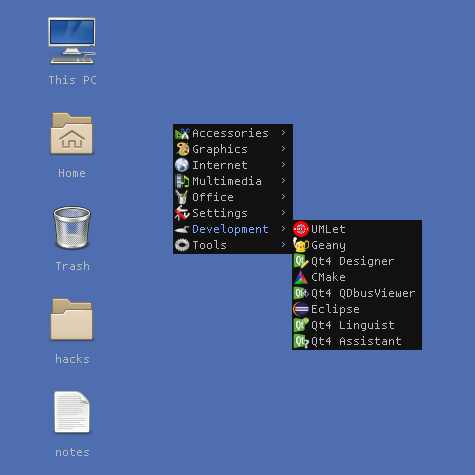

Awesome-Freedesktop
===================

-------------------------------------------------------------------
Freedesktop.org menu and desktop icons support for Awesome WM 4.x
-------------------------------------------------------------------

:First author: Antonio Terceiro
:Maintainer: Luca CPZ
:Version: git
:License: GNU-GPL2_
:Source: https://github.com/lcpz/awesome-freedesktop

Description
-----------

A port of awesome-freedesktop_ to Awesome_ 4.x.

See branches_ for previous versions.

Since the introduction of Menubar_ as a core library to provide Freedesktop.org
functionalities in Awesome, we can now avoid the dirty work by simply exploiting
``menubar.utils``.

At the moment, the menu is complete, while the desktop icons are rather simple. Our goal
is to add the following features:

- A better way to handle desktop icons path.
- Ability to drag and line up icons.
- Event-based signals, in particular:
    - Updating trash icon according to its status.
    - Dynamic update (no need to restart Awesome to see changes on the desktop).

Screenshot
----------

Installation and usage
----------------------

Read the wiki_.

.. _GNU-GPL2: http://www.gnu.org/licenses/gpl-2.0.html
.. _awesome-freedesktop: https://github.com/terceiro/awesome-freedesktop
.. _Awesome: https://github.com/awesomeWM/awesome
.. _branches: https://github.com/lcpz/awesome-freedesktop/branches
.. _Menubar: https://github.com/awesomeWM/awesome/tree/master/lib/menubar
.. _wiki: https://github.com/lcpz/awesome-freedesktop/wiki
